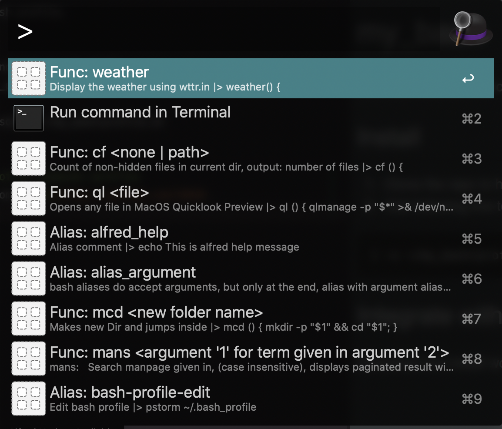

# my_bash
Common alias and functions of bash profile.

## Install 
0. Clone the repo to home dir, and name as 'my_bash'
0. Add following line to ~/.bash_profile
``` sh
[ -s ~/my_bash/profile.sh ]] && source ~/my_bash/profile.sh
```

## Integrate with Alfred bash profile commands workflow
Download and install workflow from [here](https://github.com/186dk/Alfred_run_bash_profile), so alfred will index all alias and functions as following:



